# 决策树详解

在2006年12月召开的 IEEE 数据挖掘国际会议上（ICDM， International Conference on Data Mining），与会的各位专家选出了当时的十大数据挖掘算法（ top 10 data mining algorithms ），可以参见文献【1】。本博客已经介绍过的位列十大算法之中的算法包括：

[1] kk-means算法（http://blog.csdn.net/baimafujinji/article/details/50570824）
[2] 支持向量机SVM（http://blog.csdn.net/baimafujinji/article/details/49885481）
[3] EM算法（http://blog.csdn.net/baimafujinji/article/details/50626088）
[4] 朴素贝叶斯算法（http://blog.csdn.net/baimafujinji/article/details/50441927）
[5] kkNN算法（http://blog.csdn.net/baimafujinji/article/details/6496222）
本文主要介绍机器学习中的决策树模型。决策树模型是一类算法的集合，在数据挖掘十大算法中，具体的决策树算法占有两席位置，即C4.5和CART算法，本文都会介绍到它们。

欢迎关注白马负金羁的博客 http://blog.csdn.net/baimafujinji，为保证公式、图表得以正确显示，强烈建议你从该地址上查看原版博文。本博客主要关注方向包括：数字图像处理、算法设计与分析、数据结构、机器学习、数据挖掘、统计分析方法、自然语言处理。

#### 1.1 从分类问题开始

分类（Classification）任务就是确定对象属于哪个预定义的目标类。分类问题不仅是一个普遍存在的问题，而且是其他更加复杂的决策问题的基础，更是机器学习和数据挖掘技术中最庞大的一类算法家族。我们前面介绍过的很多算法（例如SVM，朴素贝叶斯等）都可以用来解决分类问题。作为本文的开始，我们首先来简单回顾一下什么是分类。

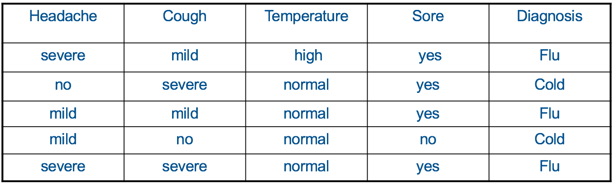

假设我们现在有如下表所示的一个属性集（feature set），它收集了几个病患的症状和对应的病症。症状包括头疼的程度、咳嗽的程度、体温以及咽喉是否肿痛，这些症状（feature）的组合就对应一个病症的分类（Cold 还是 Flu）。


**分类问题的本质就是当给定这样一个数据集后，要求我们训练出（或建立）一个模型ff**。当出现一组新的特征向量时，要求我们预测（或判断）拥有这样一组特征向量的对象应当属于哪个类别。就我们现在给出的例子而言，假设你是一名医生，现在收治了一位新的病患，然后你通过问诊得知他的一些症状（包括头疼的程度、咳嗽的程度、体温以及咽喉是否肿痛），然后你就要根据你已经建立好的模型来判断该病人得的到底是**Cold（普通感冒）还是Flu（流行性感冒）**。

分类问题的类别数目可以是**两类也可以是多类。二分类问题是最简单的分类问题**，而**多分类问题模型可以在二分类模型的基础上进行构建**。我们在前面文章中一直使用的鸢尾花数据集就是一个典型的多分类问题，问题的最终目标是判断给定一朵花，它应该属于setosa、versicolor和virginica中的哪一类。

#### 1.2 决策树基础

决策树是一种用于对实例进行分类的树形结构。决策树由节点（node）和有向边（directed edge）组成。节点的类型有两种：内部节点和叶子节点。其中，内部节点表示一个特征或属性的测试条件（用于分开具有不同特性的记录），叶子节点表示一个分类。

一旦我们构造了一个决策树模型，以它为基础来进行分类将是非常容易的。具体做法是，从根节点开始，地实例的某一特征进行测试，根据测试结构将实例分配到其子节点（也就是选择适当的分支）；沿着该分支可能达到叶子节点或者到达另一个内部节点时，那么就使用新的测试条件递归执行下去，直到抵达一个叶子节点。当到达叶子节点时，我们便得到了最终的分类结果。

下图是一个决策树的示例（注意我们仅用了两个feature就对数据集中的5个记录实现了准确的分类）：

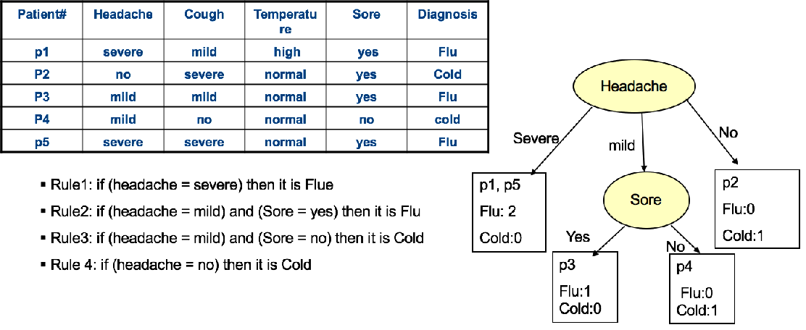


#### 1.3 构建决策树——Hunt算法

Hunt算法是一种采用局部最优策略的决策树构建算法，它同时也是许多决策树算法的基础，包括ID3、C4.5和CART等。该算法的具体执行步骤如下：

在Hunt算法中，通过将训练记录相继划分成较纯的子集，以递归方式建立决策树。设 DtDt 是与结点 tt 相关联的训练记录集，而y={y1,y2,⋯,yc}y={y1,y2,⋯,yc}是类标号，Hunt算法的递归定义如下：
(1) 如果 DtDt 中所有记录都属于同一个类，则 tt 是叶结点，用 ytyt 标记。
(2) 如果 DtDt 中包含属于多个类的记录，则选择一个属性测试条件（attribute test condition），将记录划分成较小的子集。对于测试条件的每个输出，创建一个子女结点，并根据测试结果将 DtDt 中的记录分布到子女结点中。然后，对于每个子女结点，递归地调用该算法。

为了演示这方法，我们选用文献【2】中的一个例子来加以说明：预测贷款申请者是会按时归还贷款，还是会拖欠贷款。对于这个问题，训练数据集可以通过考察以前贷款者的贷款记录来构造。在下图所示的例子中，每条记录都包含贷款者的个人信息，以及贷款者是否拖欠贷款的类标号。

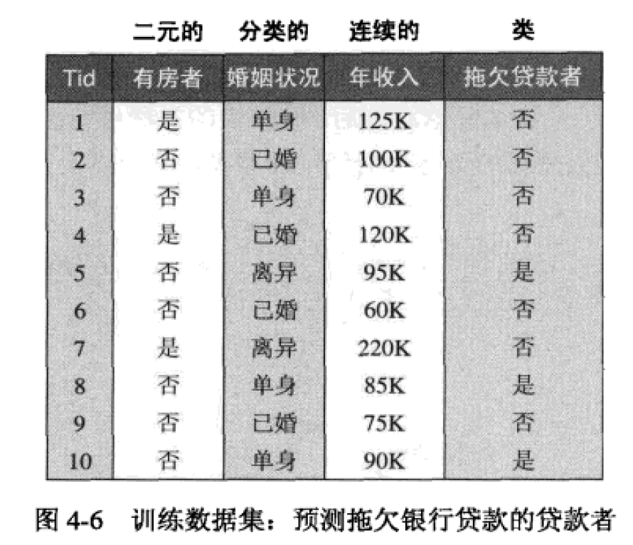


该分类问题的初始决策树只有一个结点，类标号为“拖欠货款者＝否”（见图a），意味大多数贷款者都按时归还贷款。然而，该树需要进一步的细化，因为根结点包含两个类的记录。根据“有房者”测试条件，这些记录被划分为较小的子集，如图b所示。接下来，对根结点的每个子女递归地调用Hunt算法。从下图给出的训练数据集可以看出，有房的贷款者都按时偿还了贷款，因此，根结点的左子女为叶结点，标记为“拖欠货款者二否”（见图b)。对于右子女，我们需要继续递归调用Hunt算法，直到所有的记录都属于同一个类为止。每次递归调用所形成的决策树显示在图c和图d中。

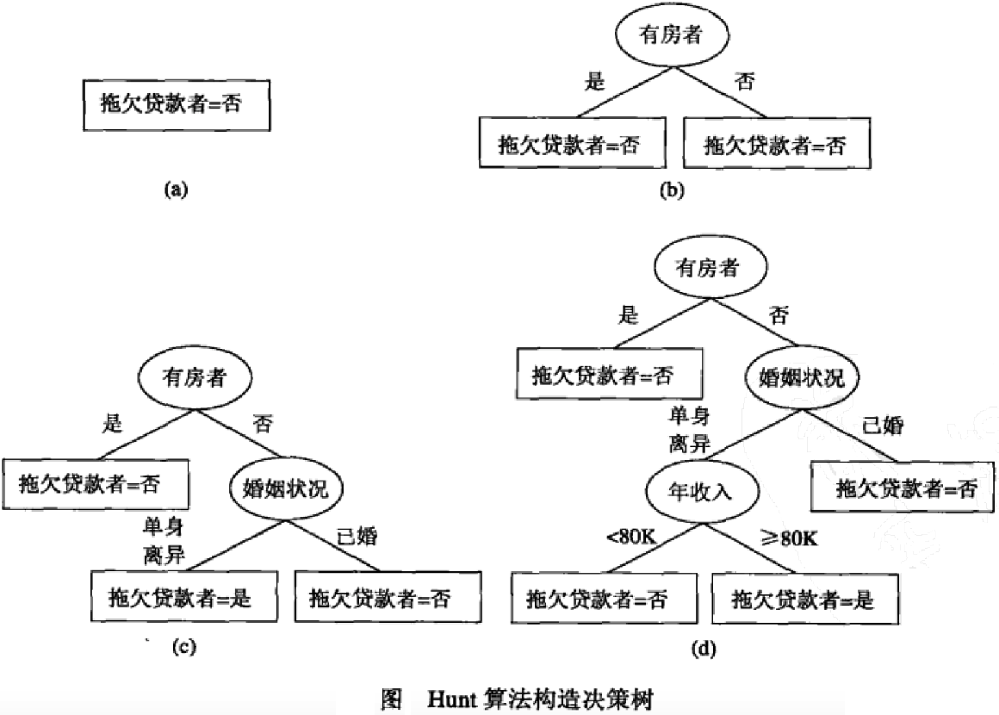

如果属性值的每种组合都在训练数据中出现，并且每种组合都具有唯一的类标号，则Hunt 算法是有效的。但是对于大多数实际情况，这些假设太苛刻了，因此，需要附加的条件来处理以下的情况：

1. 算法的第二步所创建的子女结点可能为空，即不存在与这些结点相关联的记录。如果没有一个训练记录包含与这样的结点相关联的属性值组合，这种情形就可能发生。这时，该结点成为叶结点，类标号为其父结点上训练记录中的多数类。

2. 在第二步，如果与 DtDt 相关联的所有记录都具有相同的属性值（目标属性除外），则不可能进一步划分这些记录。在这种情况下，该结点为叶结点，其标号为与该结点相关联的训练记录中的多数类。

   

**此外，在上面这个算法过程中，你可能会疑惑**：我们是依据什么原则来选取属性测试条件的，例如为什第一次选择“有房者”来作为测试条件。事实上，如果我们选择的属性测试条件不同，那么对于同一数据集来说所建立的决策树可能相差很大。如下图所示为基于前面预测病人是患了Cold还是Flu的数据集所构建出来的另外两种情况的决策树：


事实上，在构建决策树时我们需要关心的问题包括：

> How to build optimal Decision Tree?
> How to choose attribute values at each decision point (node)?
> How to choose number of branches at each node and attribute values for partitioning the data?
> When to stop the growth of the tree?


##### 我会在接下来的部分回答上述这些问题


#### 1.3构建决策树进阶：GiniGini测度与划分

构建一棵最优的决策树是一个NP难问题！所以我们只能采用一些启发式策略来解决：

> Choose an attribute to partition the data at the node such that each partition is as homogeneous (least impure) as possible. This means we would like to see most of the instances in each partition belonging to as few classes as possible and each partition should be as large as possible.
> We can stop the growth of the tree if all the leaf nodes are largely dominated by a single class (that is the leaf nodes are nearly pure).


现在新的问题来了：如何评估节点的Impurity？通常可以使用的指标有如下三个（实际应用时，只要选其中一个即可）：

> Gini Index
> Entropy
> Misclassification error
> 第一个可以用来评估节点Impurity的指标是Gini系数。对于一个给定的节点 tt，它的Gini系数计算公式如下：
>


其中，p(j | t)p(j | t) is the relative frequency of class jj at node tt（即表示给定节点 tt 中属于类 jj 的记录所占的比例）。通过这个计算公式你可以看出：


> Maximum value of Gini index = (1 - 1/ncnc) when records are equally distributed among all classes, implying least interesting information or most impure.
> Minimum is (0.0) when all records belong to one class, implying most interesting information or most pure or most homogeneous.


> 说到这里，我们插一句题外话（如果你对这部分Background无感可以跳过）。你在生活中有没有听过基尼系数这个名词？是的，基尼系数本来是经济学里的一个概念。基尼系数是1943年美国经济学家阿尔伯特·赫希曼根据劳伦茨曲线所定义的判断收入分配公平程度的指标。基尼系数是比例数值，在0和1之间，是国际上用来综合考察居民内部收入分配差异状况的一个重要分析指标。其具体含义是指，在全部居民收入中，用于进行不平均分配的那部分收入所占的比例。基尼系数最大为“1”，最小等于“0”。前者表示居民之间的收入分配绝对不平均，即100%的收入被一个单位的人全部占有了；而后者则表示居民之间的收入分配绝对平均，即人与人之间收入完全平等，没有任何差异。但这两种情况只是在理论上的绝对化形式，在实际生活中一般不会出现。因此，基尼系数的实际数值只能介于0～1之间，基尼系数越小收入分配越平均，基尼系数越大收入分配越不平均。国际上通常把0.4作为贫富差距的警戒线，大于这一数值容易出现社会动荡。

选择最佳划分的度量通常是根据划分后子女结点不纯性的程度。不纯的程度越低，类分布就越倾斜。例如，类分布为 (0, 1)的结点具有零不纯性，而均衡分布(0.5, 0.5)的结点具有最高的不纯性。现在我们回过头来看一个具体的计算例子。现在我们一共有6个records，以二元分类问题不纯性度量值的比较为例，下图的意思表示有四个节点，然后分别计算了每一个节点的GINI系数值（注意决策树中每一个内节点都表示一种分支判断，也就可以将6个records分成几类，我们这里讨论的是二元分类所以是分成两个子类）：

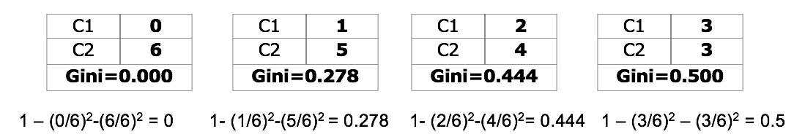

从上面的例子可以看出，第一个结点，具有最低的不纯性度量值，接下来节点的不纯度度量值依次递增。为了确定测试条件的效果，我们需要比较父结点（划分前）的不纯程度和子女结点（划分后） 的不纯程度，它们的差越大，测试条件的效果就越好。增益ΔΔ是一种可以用来确定划分效果的标准：


其中，I(.)I(.) 是给定结点的不纯性度量，NN是父结点上的记录总数，kk是属性值的个数，N(vj)N(vj)是与子女结点 vjvj 相关联的记录个数。决策树构建算法通常选择最大化增益ΔΔ的测试条件，因为对所有的测试条件来说，I(parent)I(parent)是一个不变的值，所以最大化增益等价于最小化子女结点的不纯性度量的加权平均值。
 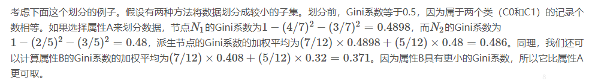


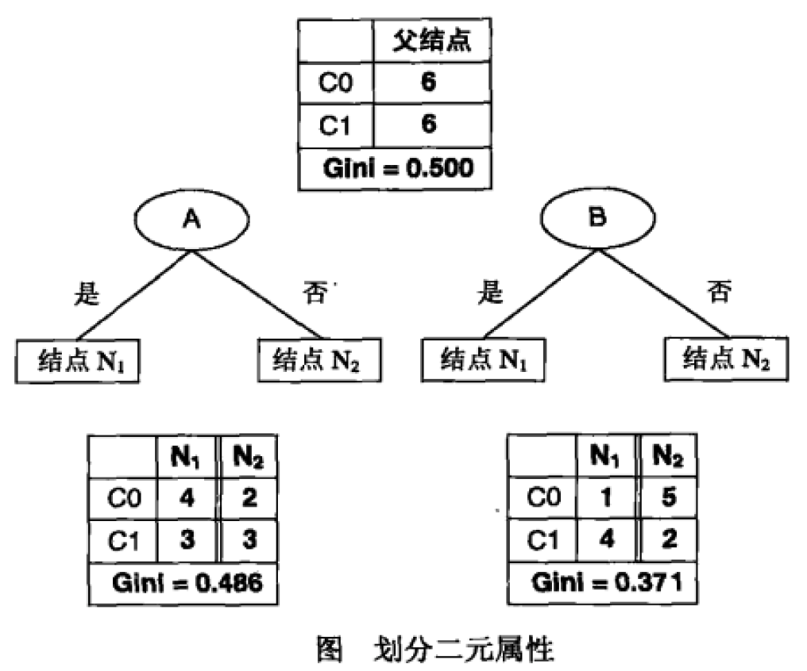

#### 考虑多分类的情况

标称属性可以产生二元划分也可以产生多路划分，如下图所示。二元划分的Gini系数的计算与二元属性类似。对于车型属性第一种二元分类，{运动，豪华}的Gini系数是0.4922，而{家用}的Gini系数是0.375。这个划分的Gini系数加权平均是：

```
(16/20)×0.4922+(4/20)×0.375=0.468
```


类似地，对第二种二元划分{运动}和{家用，豪华}，Gini系数加权平均是0.167。第二种划分的Gini系数相对更低，因为其对应的子集的纯度更高。对于多路划分，需要计算每个属性值的Gini系数。Gini({家用})=0.375，Gini({运动})=0，Gini({豪华})=0.219，所以多路划分的Gini系数加权平均值为：

```
(4/20)×0.375+(8/20)×0+(8/20)×0.219=0.163
```


多路划分的Gini系数比两个二元划分都小。这是因为二元划分实际上合并了多路划分的某些输出，自然降低了子集的纯度。

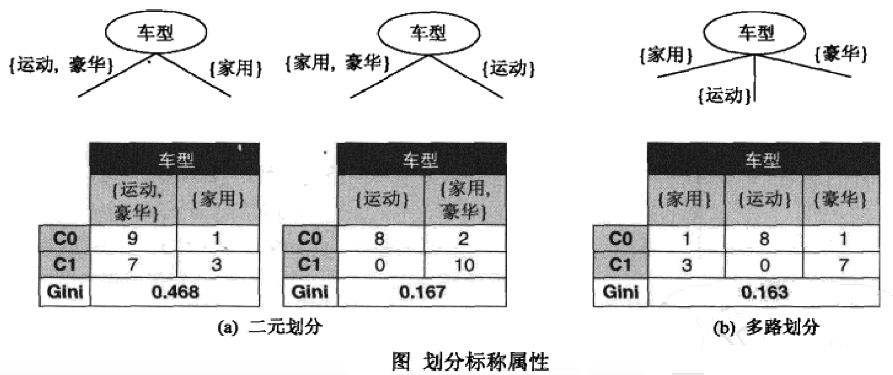


#### 考虑特征值连续的情况

考虑下图所示的例子，其中测试条件“年收入≤v≤v”用来划分拖欠贷款分类问题的训练记录。用穷举方法确定 vv 的值，将NN个记录中所有的属性值都作为候选划分点。对每个候选vv，都要扫描一次数据集，统计年收入大于和小于vv的记录数，然后计算每个候迭的Gini系数，并从中选择具有最小值的候选划分点。这种方法的计算代价显然是高昂的，因为对每个候选划分点计算 Gini系数需要O(N)O(N)次操作，由于有NN个候选，总的计算复杂度为O(N2)O(N2)。为了降低计算复杂度， 按照年收入将训练记录排序，所需要的时间为O(NlogN)O(Nlog⁡N)，从两个相邻的排过序的属性值中选择中间值作为候选划分点，得到候选划分点55, 65, 72等。无论如何，与穷举方法不同，在计算候选划分点的Gini指标时，不需考察所有NN个记录。

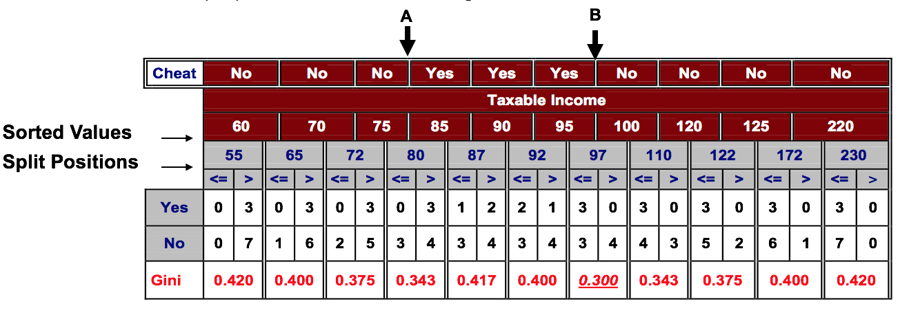

对第一个候选v=55v=55，没有年收入小于$55K的记录，所以年收入＜$55K的派生结点的Gini系数是0；另一方面，年收入≥≥$55K的样本记录数目分别为3（类Yes）和7（类No)。如此一来，该结点的Gini系数是0.420。该候选划分的Gini系数的加权平均就等于0×0+1×0.42=0.420×0+1×0.42=0.42。

对第二个候选v=65v=65，通过更新上一个候选的类分布，就可以得到该候选的类分布。更具体地说，新的分布通过考察具有最低年收入（即$60K）的记录的类标号得到。因为该记录的类标号是No所以类No的计数从0增加到1（对于年收入≤≤$65K），和从7降到6（对于年收入>> $65K），类Yes的分布保持不变。新的候选划分点的加权平均Gini系数为0.4。

重复这样的计算，直到算出所有候选的Gini系数值。最佳的划分点对应于产生最小Gini系数值的点，即v=97v=97。该过程代价相对较低，因为更新每个候选划分点的类分布所需的时间是一个常数。该过程还可以进一步优化：仅考虑位于具有不同类标号的两个相邻记录之间的候选划分点。例如，因为前三个排序后的记录（分别具有年收入$60K、 $70K和$75K)具有相同的类标号，所以最佳划分点肯定不会在$60K和$75K之间，因此，候选划分点 vv = $55K、 $65K、 $72K、 $87K、 $92K、 $110K、 $122K、 $172K 和 $230K都将被忽略，因为它们都位于具有相同类标号的相邻记录之间。该方法使得候选划分点的个数从11个降到2个。

#### 其他纯度测量指标暨划分标准

正如我们前面已经提到的，评估节点的Impurity可以是三个标准中的任何一个。而且我们已经介绍了Gini系数。

##### 信息熵与信息增益

下面来谈谈另外一个可选的标准：信息熵（entropy）。在信息论中，熵是表示随机变量不确定性的度量。熵的取值越大，随机变量的不确定性也越大。

设XX是一个取有限个值的离散随机变量，其概率分布为


则随机变量XX的熵定义为


在上式中，如果pi=0pi=0，则定义0log0=00log⁡0=0。通常，上式中的对数以2为底或以ee为底，这时熵的单位分别是比特（bit）或纳特（nat）。由定义可知，熵只依赖于 XX 的分布，而与 XX 的取值无关，所以也可以将XX 的熵记作 H(p)H(p)，即


条件熵H(Y|X)H(Y|X)表示在已知随机变量XX的条件下随机变量YY的不确定性，随机变量XX给定的条件下随机变量YY的条件熵（conditional entropy）H(Y|X)H(Y|X)，定义为XX给定条件下YY的条件概率分布的熵对XX的数学期望：
 

就我们当前所面对的问题而言，如果给定一个节点 tt，它的（条件）熵计算公式如下：


其中，p(j | t)p(j | t) is the relative frequency of class jj at node tt（即表示给定节点 tt 中属于类 jj 的记录所占的比例）。通过这个计算公式你可以看出：


Maximum (lognc)(log⁡nc) when records are equally distributed among all classes implying least information
Minimum (0.0) when all records belong to one class, implying most information


还是来看一个具体的计算例子，如下图所示（基本情况与前面介绍Gini系数时的例子类似，我们不再赘述）：

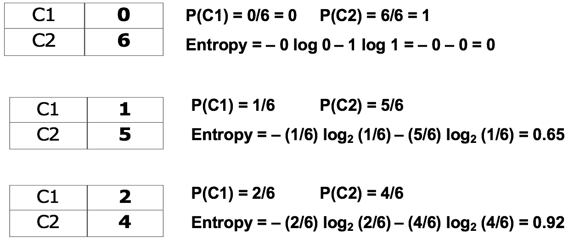

以此为基础，我们要来定义信息增益（Information Gain）如下：


其中，Parent Node, pp is split into kk partitions; nini is number of records in partition ii.
与之前的情况相同，决策树构建算法通常选择最大化信息增益的测试条件来对节点进行划分。
使用信息增益的一个缺点在于：信息增益的大小是相对于训练数据集而言的。在分类问题困难时，即训练数据集的经验熵比较大时，信息增益会偏大。反之，信息增益会偏小。使用信息增益比（Information gain ratio）可以对这一问题进行校正。
 

于是，Higher entropy partitioning (large number of small partitions) is penalized!
分类误差
给定一个节点tt，它的分类误差定义为：


由此公式可知：
Maximum (1−1/nc)(1−1/nc) when records are equally distributed among all classes, implying least interesting information
Minimum (0.0) when all records belong to one class, implying most interesting information
话不多说，还是一个简单的算例：

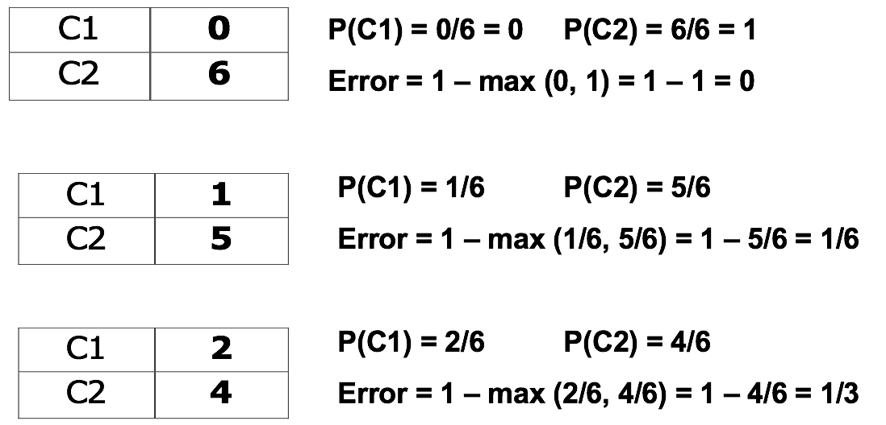

下图给出了二分类模型中，熵、Gini系数、分类误差的比较情况。如果我们采用二分之一熵12H(p)12H(p)的时候，你会发现它与Gini系数将会相当接近。

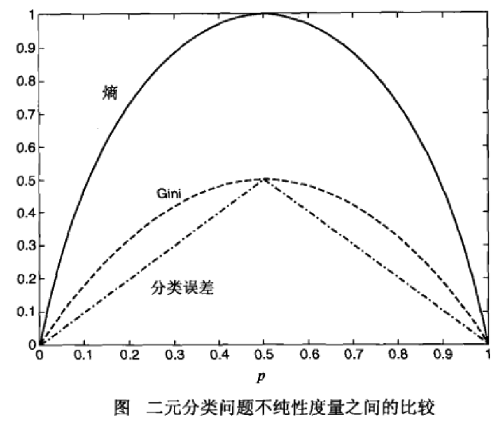


我们最后再来看一个Gini系数和分类误差对比的例子：

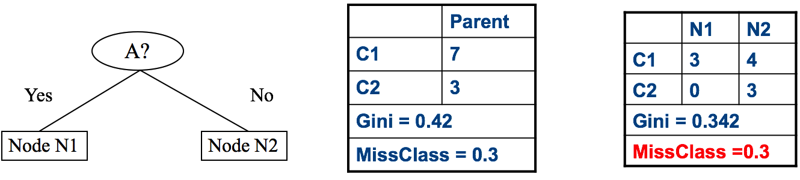

来计算一下加权平均的Gini系数：


再来计算一下分类误差：


可见在这个例子中，Gini improves ! However，Missclassification unchanged! 我们会在下一篇文章中继续介绍关于ID3、C4.5和CART算法的内容，其中会更加具体地用到本文所介绍的各种纯度评判标准。
（未完，待续…）

参考文献
【1】Wu, X., Kumar, V., Quinlan, J.R., Ghosh, J., Yang, Q., Motoda, H., McLachlan, G.J., Ng, A., Liu, B., Philip, S.Y. and Zhou, Z.H., 2008. Top 10 algorithms in data mining. Knowledge and information systems, 14(1), pp.1-37. (http://www.cs.uvm.edu/~icdm/algorithms/10Algorithms-08.pdf）
【2】Pang-Ning Tan, Michael Steinbach, Vipin Kumar, 数据挖掘导论，人民邮电出版社
【3】李航，统计学习方法，清华大学出版社
【4】明尼苏达大学Prof Vipin Kumar 和墨尔本大学Prof Rao Kotagiri的课程幻灯片材料
 